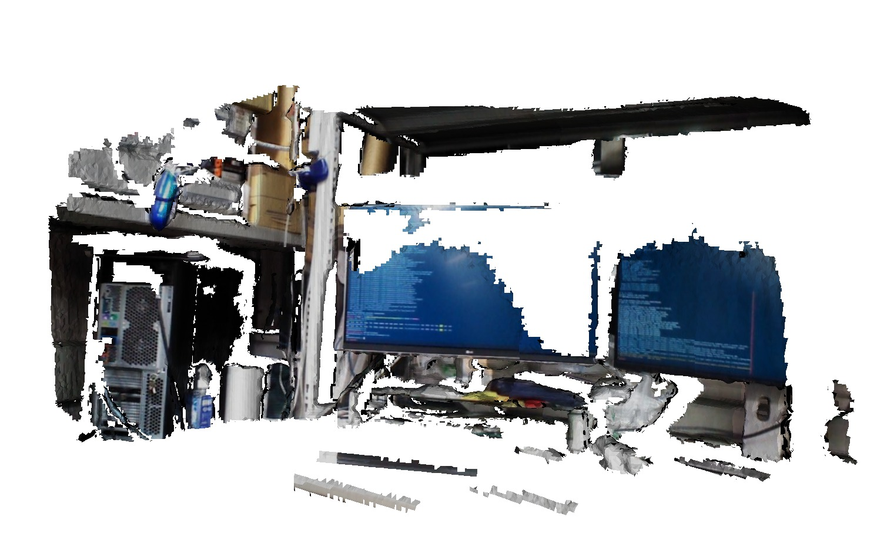

# Kinfu


Use kinfu (kinect fusion) for model generation and SLAM.


## Subscribing Topics

* `~input/camera_info` (`sensor_msgs/CameraInfo`)

  Intrinsic camera parameter of depth image

* `~input/depth` (`sensor_msgs/Image`)

  Input depth image.

* `~input/color` (`sensor_msgs/Image`)

  RGB color image (subsribed if `~integrate_color` is `true`).


## Publishing Topics

* `~output` (`geometry_msgs/PoseStamped`)

  Pose of camera

* `~output/cloud` (`sensor_msgs/PointCloud2`)

  Registered scene pointcloud

* `~output/rendered_image` (`sensor_msgs/Image`)

  Rendered image of kinfu model in current camera view.

* `~output/generated_depth` (`sensor_msgs/Image`)

  Generated depth of kinfu model in current camera view.


## Advertising Services

* `~reset` (`std_srvs/Empty`)

  Reset tracking and mapping of kinfu.

* `~save_mesh` (`std_srvs/Empty`)

  Convert tsdf to mesh using marching cubes algorithm, saved `mesh.obj` under `~save_dir`.


## Parameters

* `~queue_size` (Int, default: `10`)

  Size of message queue for synchronization.

* `~auto_reset` (Boolean, default `true`)

  Flag to auto reset if ICP tracking is lost.

* `~integrate_color` (Boolean, default: `false`)

  Flag to integrate color for tracking and mapping.
  If `true`, `~input/color` is also Subscribed.

* `~slam` (Boolean, default: `false`)

  Flag to publishing tf `map` relative to `odom_init`.


## Sample


### Without SLAM

```bash
roslaunch jsk_pcl_ros sample_kinfu.launch
rosservice call /kinfu/save_mesh  # saves mesh model below
```




## With SLAM

<div class="text-center">
  <iframe src="https://drive.google.com/file/d/0B9P1L--7Wd2vVlMwNjJNeGVIV0E/preview?autoplay=1" width="640" height="350" frameborder="0"></iframe>
</div>